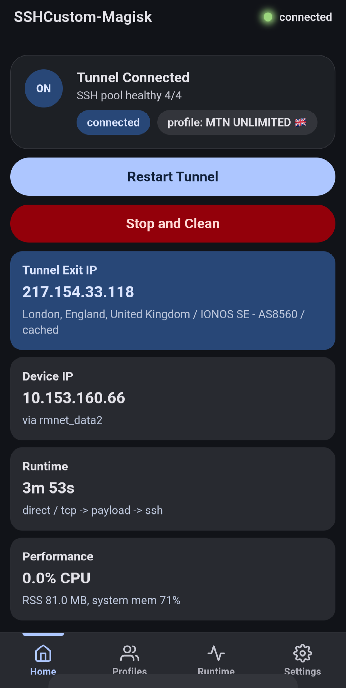
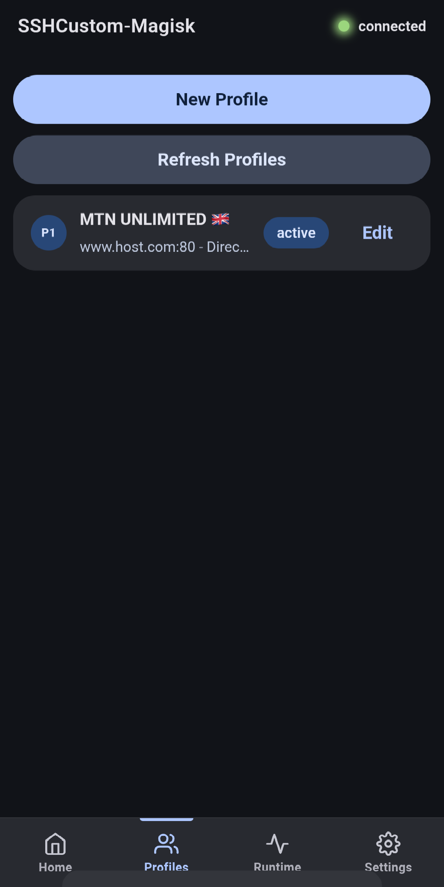
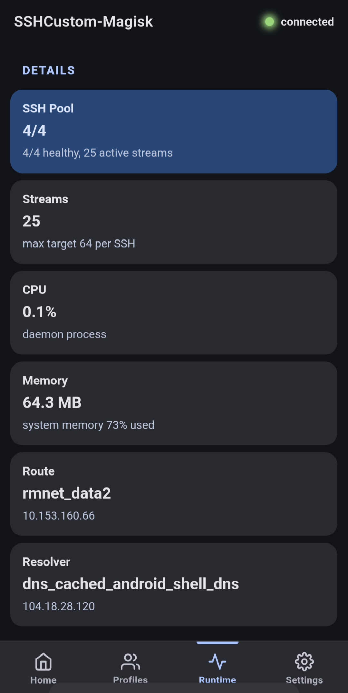
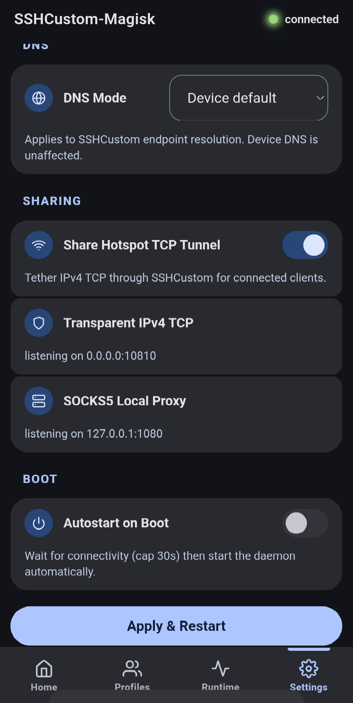

# SSHCustom-Magisk

Transparent SSH tunnel proxy for rooted Android. Routes all device **TCP and UDP** traffic through a single SSH connection — no per-app configuration, no VPN slot consumed. TPROXY-based UDP forwarding via BadVPN UDPGW.

[](LICENSE)
[](https://github.com/topjohnwu/Magisk)
[](https://github.com/tiann/KernelSU)

## Screenshots

<p align="center">
  
  
  
  
</p>

## Features

- **Transparent TCP + UDP proxy** — TCP via iptables REDIRECT, UDP via TPROXY (mangle table) with BadVPN UDPGW client. All traffic through one SSH connection.
- **DNS-through-tunnel** — device DNS queries proxied as TCP DNS through SSH to prevent leaks.
- **Fast reconnect** — dead-connection detection in 5-16s (was 45-60s). Aggressive TCP keepalive + reactive MarkDead on first stream failure. Auto-reconnect with exponential backoff.
- **SOCKS5 proxy** — local proxy at `127.0.0.1:1080` for apps that support proxy configuration.
- **Hotspot sharing** — share the tunnel over Wi-Fi, USB, or Bluetooth tethering.
- **Web dashboard** — Material 3 UI at `http://127.0.0.1:9190` with Home, Profiles, Runtime, and Settings tabs. Always available even without an active tunnel.
- **Lean engine** — single SSH connection with RFC 4254 multiplexing. ~13 MB idle RAM, ~30–40 MB under load.
- **Auto-reconnect** — exponential backoff (2s–60s) on unexpected disconnect. Tunnel restarts automatically.
- **Stream retry** — failed streams retry up to 2x for transient server-side errors. Prevents IDM disconnects during downloads.
- **256 max streams** — sufficient for heavy multi-threaded downloads.
- **Kernel-level dead-link detection** — `TCP_USER_TIMEOUT=30s` on the carrier socket catches silent drops fast.
- **Captive portal bypass** — daemon serves HTTP 204 locally. No "no internet" warnings on zero-bug hosts.
- **QUIC blocking** — UDP 80/443 dropped to force TCP fallback through the tunnel.
- **IPv6 disabled** — prevents leaks past the IPv4-only REDIRECT.
- **Multiple transport modes** — direct SSH, HTTP proxy, TLS/SNI, payload injection.
- **Dropbear compatible** — vendored x/crypto with Dropbear patches.
- **KSU / KSU Next compatible** — fixed "unknown" module display. Stable across all root managers.

### UDP Proxy (Optional)

UDP proxying requires [BadVPN UDPGW](https://github.com/ambrop72/badvpn) running on your SSH server (default port 7300). Your server panel (e.g., HTTP Custom setup) likely already includes it. Enable via `udp_proxy.enabled: true` in the WebUI Settings.

## Installation

1. Download the latest release ZIP from the [Releases page](https://github.com/GoodyOG/SSHCustom-Magisk/releases/latest).
2. Flash in **Magisk 24.0+** or **KernelSU 0.5.0+**.
3. Reboot your device.
4. Open the WebUI, add your SSH server profile in the **Profiles** tab, and tap **Start Tunnel**.

## Accessing the WebUI

- **KernelSU / KSU-Next** — open the module WebUI directly from the manager.
- **WebUI-X Portable** — install [WebUI-X Portable](https://github.com/MMRLApp/WebUI-X-Portable). SSHCustom appears in the module list with full edge-to-edge support and a home screen shortcut option.
- **Magisk** — install [KsuWebUI Standalone](https://github.com/KOWX712/KsuWebUIStandalone/releases), grant root, then open SSHCustom from within it.
- **Browser** — navigate to `http://127.0.0.1:9190` on the device.

## Building from Source

Requires Go 1.23+ and Python 3.8+.

```bash
./build.sh
```

The script cross-compiles for ARM64 and ARMv7, then packages a flashable Magisk ZIP into `dist/`.

Read `docs/openapi.yaml` for the full REST + SSE API specification.

## License

Apache 2.0 — see [LICENSE](LICENSE).

**Disclaimer:** This tool is for educational use. Users are responsible for complying with their ISP's terms of service and local laws.
